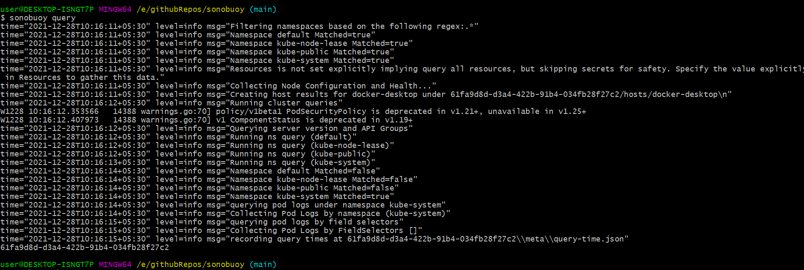
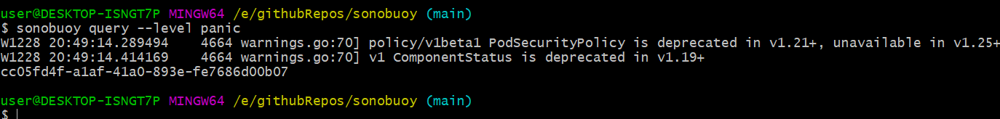

# New `sonobuoy query` command

## Intro

- `sonobuoy query` command runs queries against our cluster and helps in debugging by providing useful information about the cluster which helps us to find bugs and fix them before they can cause any severe harm to the cluster . These queries were run from the aggregator pod (made through sonobuoy run) in the past. But now we can run them locally, even without running sonobuoy or bother launching pods and waiting for processing. We have to just run sonobuoy query.

  

- The logs are generated via logrus (https://github.com/sirupsen/logrus), which contains three parts
  `time, level, msg`.
- `msg` provides information about the cluster which helps us to find bugs in our clusters and tackle them.

- `level` specifies the level of logs. Default value is `info`, which basically put no filters while returning logs. We can specify it by the help of `--level` flag. It can take values like `{panic, fatal, error, warn, info, debug, trace}`. Each value logs the information according to there functionality, like in case of `panic` we get warnings and info about the cluster of which we should be careful about.

  

- While logging we can also specify **sonobuoy config file** which contains all info about our runs `(sonobuoy run)`, and we get the logs accordingly. We can do that by `--config` flag, we have to provide path to our config in the argument.
- We can also save our output through `--output` flag, we have to specify path to the directory in which we want to save our data in.
